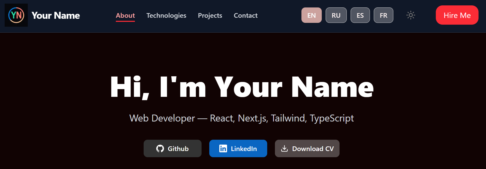
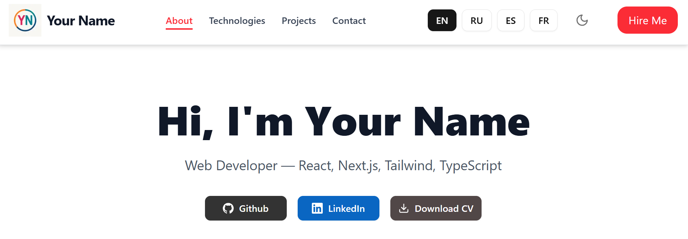
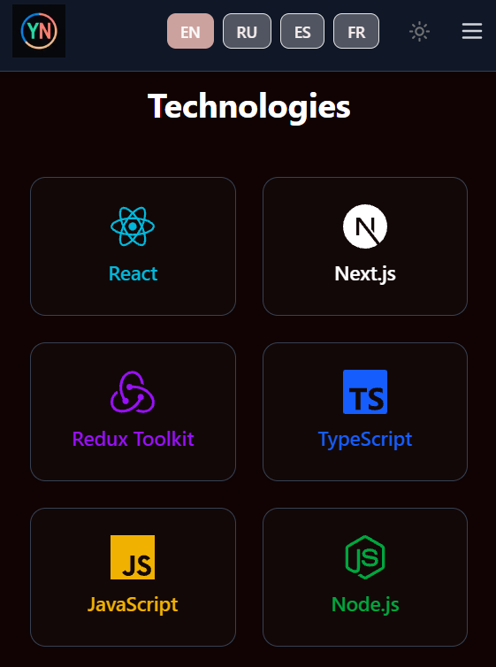
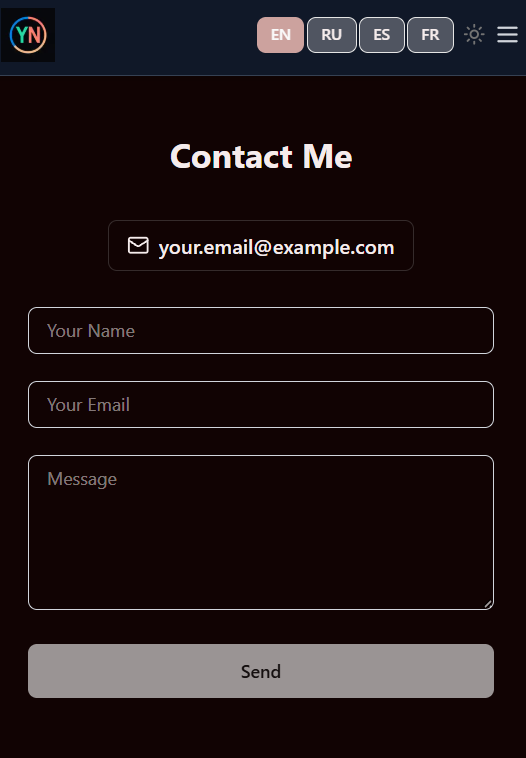
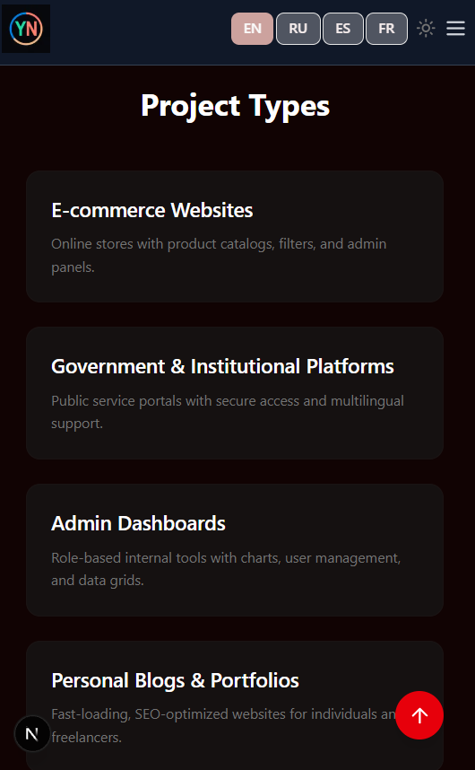

# Webfolio – Developer Portfolio Template

A modern, customizable portfolio template for developers. Built with **Next.js 15**, **Tailwind CSS**, **TypeScript**, and **shadcn/ui**.

---

## 🔍 Demo

🌐 Live demo: [https://webfolio-template-demo.vercel.app](https://webfolio-template-demo.vercel.app)


 
 
 
 
 

---

## ✨ Features

- 🌍 Multilanguage support: **EN**, **RU**, **ES**, **FR** (easily extendable)
- 🗂️ Fully dynamic language configuration via `siteConfig`
- 🎨 Two themes: **dark** and **light** (auto-switch or manual toggle)
- 📁 Replace images, logos, or PDF resume directly via `/public` folder (just keep filenames the same)
- 🧭 Configurable navigation menu items
- 🔗 Flexible contact/social links with icons – add or remove easily
- ⚡️ Powered by **Next.js 15 (App Router)** with great performance and SEO
- 🎨 Styled using **Tailwind CSS** and **shadcn/ui**
- 📱 Fully responsive and mobile-friendly layout
- 📨 Contact form via **Formspree** (easily replaceable with other backends)
- ⚙️ Centralized configuration – change everything from a single file

---

## 🛠️ Tech Stack

- **Next.js 15 (App Router)**
- **TypeScript**
- **Tailwind CSS**
- **shadcn/ui**
- **react-icons**
- **Formspree**
- **Vercel** for deployment

---

## 🚀 Getting Started

```bash
cd webfolio-template
npm install
npm run dev
